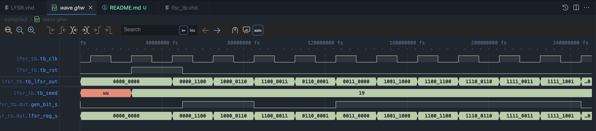

# Gaussian Distribution Generator

A VHDL implementation of a Gaussian distribution generator

## Project Overview

This project implements a Fibonacci LFSR (Linear Feedback Shift Register) in VHDL, which generates pseudo-random binary sequences. LFSRs can generate numbers across a uniform distribution; this set has equal probability across the full range. More practical distributions are the Gaussian or Normal Distribution which follow the Central Limit Theorem. Numbers closer to the mean are more likely to occur; rhis is also known as a bell curve. 

By way of the Box-Muller Theorem, we can take two samples from the uniform distribution and convert them into the normal distribution.

## Usage

I am using GHDL / Icarus-verilog for analysis and elaboration step to create a .ghw / .vcd. These waveforms can be viewed in the VS Code extension VaporView. 

- **GHDL** - VHDL compiler and simulator
- **Make** - For using the provided Makefile
- **GTKWave** (optional) - For viewing simulation waveforms

## LFSR Configuration

The current implementation uses:
- **Width**: 8 bits
- **Taps**: Positions 4 and 2 (for feedback polynomial)
- **Type**: Fibonacci configuration

## Example Waveform
